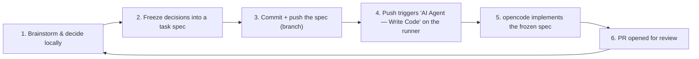

# Local-prep → Runner handoff for long-running tasks

This is the workflow we use for long-running implementation tasks. The principle is
simple and non-negotiable:

> **All decisions are made locally, up front, by a human (or an agent session) through
> brainstorming and explicit sign-off. The code-writing agent inside the CI runner receives
> a fully frozen task spec and implements it — it does NOT make decisions.**

This is exactly what happened for the scaffold task (issue #5): the stack (Fastify, Drizzle,
Vitest, pnpm, Vite, Node 26), the CI shape, and the phase-gate handling were all decided in
conversation and approved before anything was handed to an agent.

## The loop



## How to use it

### Step 1 — Decide locally
Do the brainstorming and decision-making in your normal working session (as we did for
issue #5). For every genuinely open choice, **stop and get explicit approval** — never let
the runner agent decide. Record significant decisions as `DEC-*` records per
`decisions/PROCEDURES.md` where the framework requires it.

### Step 2 — Freeze the task spec
Create a file `.agents/tasks/<task-name>.md` from the template
([`tasks/_template.md`](tasks/_template.md)). It must contain:

- The **goal, context, and exact task** (step-by-step, unambiguous).
- A **Frozen decisions** table — every decision already made, which the agent must implement
  as-is and must not revisit.
- **Out of scope** — what the agent must NOT build.
- **Acceptance criteria** and the exact **verification commands** it must run and report.

The spec is the single source of truth for the run. If it does not fully specify the task,
the agent is instructed to implement only what is unambiguous and to **report the open
decision** rather than guess.

### Step 3 — Commit and push
On a branch that is **not `main`**:

```bash
git checkout -b feat/my-task
# ... write .agents/tasks/my-task.md ...
git add .agents/tasks/my-task.md
git commit -m "docs(agents): task spec: <title>"
git push -u origin feat/my-task
```

Pushing a task spec (any `.md` in `.agents/tasks/` except `_template.md`) triggers the
**AI Agent — Write Code** workflow automatically. The runner opencode agent reads the pushed
spec, implements it on a fresh `ai/write/<run_id>` branch, and opens a PR to `main`.

> Optional: an `issue:` line in the spec front-matter links the resulting PR to an issue
> (e.g. `issue: 5`).

### Step 4 — Manual dispatch (alternative to push)
You can hand off the same way, without a push, from the Actions tab or CLI. Two variants:

```bash
# a) frozen task text (optionally linked to an issue)
gh workflow run ai-write-code.yml \
  --repo Franck-Sorel/douala-trust \
  -f task="<full frozen task text>" \
  -f issue=5 \
  -f base_branch=main

# b) drive it straight from a GitHub issue: the issue BODY becomes the task
gh workflow run ai-write-code.yml \
  --repo Franck-Sorel/douala-trust \
  -f issue=6 \
  -f base_branch=main
```

With `issue` alone, the runner fetches the issue title/body and implements them (the issue's
acceptance criteria act as the task). With both, the frozen `task` text wins and the issue is
only linked from the PR. `base_branch` is the branch the work starts from and the PR's base —
point it at the branch that already holds prerequisite work when `main` does not.

`workflow_dispatch` is what you use when the prerequisite work lives on another branch; the
push path remains the preferred one for specs on `main`.

### Step 5 — Review the PR
The workflow does not auto-merge. Review the PR (optionally with the **AI Agent — Review PR**
workflow), run `/SDLC-validate` if it touches SDLC artifacts, then merge.

## Rules

- The runner agent **never** makes implementation decisions.
- Freeze **everything** ambiguous before pushing — do not expect the runner to ask questions.
- Keep `.agents/tasks/_template.md` untouched as the template (it does not trigger runs).
- Committing a spec that only documents context (no task) could still trigger a run by
  mistake — keep specs task-ready before pushing.
