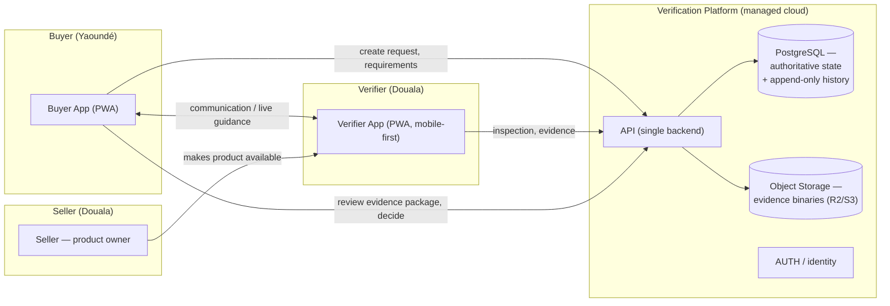

# Architecture

**Status**: Draft

**Purpose**: System architecture for the **MVP**: components, responsibilities, and
interactions for one complete verification transaction (Yaoundé buyer ↔ Douala verifier),
grounded in the ADR decision set and the active `decisions/` records.

## Design scope (constraints)

- MVP = one verification transaction, not the platform ([DEC-mvp-scope](../decisions/DEC-mvp-scope.md)).
- No single actor controls the whole transaction ([CON-separate-responsibilities](../1-spec/constraints/CON-separate-responsibilities.md)).
- The platform verifies, it does not certify or guarantee ([CON-verification-not-certification](../1-spec/constraints/CON-verification-not-certification.md)).

## Overview



## Components and responsibilities (ADR-003 separation)

| Component | Responsibility | Owner |
|-----------|----------------|-------|
| Buyer App (PWA) | Create verification request + requirements; communicate; review evidence; record decision | [REQ-F-create-verification-request](../1-spec/requirements/REQ-F-create-verification-request.md), [REQ-F-review-evidence](../1-spec/requirements/REQ-F-review-evidence.md) |
| Verifier App (PWA, mobile-first) | Guided inspection; identity confirmation; evidence capture; per-requirement results | [REQ-F-capture-evidence](../1-spec/requirements/REQ-F-capture-evidence.md), [REQ-USA-mobile-verifier](../1-spec/requirements/REQ-USA-mobile-verifier.md) |
| API | Routed assignment; state-transition validation; idempotency; authorization; evidence upload/download | [DEC-state-transition-validation](../decisions/DEC-state-transition-validation.md), [DEC-idempotency](../decisions/DEC-idempotency.md), [DEC-evidence-access-control](../decisions/DEC-evidence-access-control.md) |
| PostgreSQL | Authoritative state + append-only history (single source of truth) | [DEC-authoritative-single-source](../decisions/DEC-authoritative-single-source.md) |
| Object Storage | Evidence binaries, referenced by DB, signed-access | [DEC-evidence-storage-separated](../decisions/DEC-evidence-storage-separated.md) |

## Core interaction flow (the MVP vertical slice)

```mermaid
sequenceDiagram
  participant B as Buyer
  participant A as API
  participant V as Verifier
  participant D as Postgres
  participant O as Object Store

  B->>A: create verification request (product + requirements)
  A->>D: persist request + structured requirements
  A->>V: assign verifier (independent)
  V->>A: establish product identity (evidence)
  A->>D: store identity; block on mismatch (ADR-042)
  V->>A: run guided inspection; capture evidence per requirement
  A->>O: store evidence binaries
  A->>D: store evidence refs + hashes + provenance
  V->>A: submit results (PASS/FAIL/INCONCLUSIVE/NOT_TESTED)
  A->>D: atomically record results + frozen req version (immutable)
  A-->>B: evidence package ready
  B->>A: review evidence; record decision (ACCEPT/REJECT/REQUEST_MORE_EVIDENCE)
```

## Key architecture decisions applied (from `decisions/`)

- **Independent verifier**: separate from seller/custody/payment roles ([DEC-verifier-independent-evidence](../decisions/DEC-verifier-independent-evidence.md)).
- **Evidence over verdicts**: observations + evidence, scoped claims ([DEC-evidence-over-verdicts](../decisions/DEC-evidence-over-verdicts.md), [DEC-outcome-semantics](../decisions/DEC-outcome-semantics.md)).
- **Identity before inspection**, mismatch blocks ([DEC-product-identity](../decisions/DEC-product-identity.md)).
- **Requirements structured + frozen** ([DEC-requirements-first-class](../decisions/DEC-requirements-first-class.md)).
- **Independent state machines** for transaction / inspection / decision ([DEC-inspection-state-separation](../decisions/DEC-inspection-state-separation.md)).
- **Immutable append-only history** ([DEC-evidence-immutable-append-only](../decisions/DEC-evidence-immutable-append-only.md)).
- **Separated evidence storage** + role-based access ([DEC-evidence-storage-separated](../decisions/DEC-evidence-storage-separated.md), [DEC-evidence-access-control](../decisions/DEC-evidence-access-control.md)).

## Out of MVP scope (deferred per [DEC-mvp-scope](../decisions/DEC-mvp-scope.md))

Payments automation, dispute-resolution engine, custody/logistics network, expert-escalation
marketplace, AI-generated observations, asynchronous projections / outbox / dead-letter
infrastructure, complex distributed concurrency. These are anticipated by the ADR register
(`docs/adr/`) but not implemented in the first release.

## Hosting (decision record — see `4-deploy/`)

Managed cloud: API + PostgreSQL (authoritative) + private object storage (Cloudflare R2/S3)
served via short-lived signed URLs. Cloudflare handles static/app delivery facing Cameroonian
mobile networks. No broker/stream infra in the MVP.
