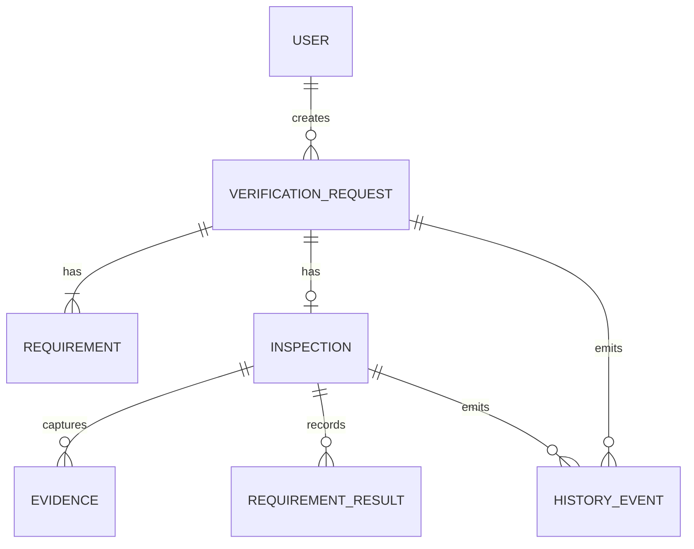

# Data Model

**Status**: Draft

**Purpose**: Persistent data entities for the MVP, grounded in the ADR decision set
(identity, structured/frozen requirements, evidence storage separation, immutable history,
state separation).

> Authoritative state in PostgreSQL; evidence binaries in object storage
> ([DEC-evidence-storage-separated](../decisions/DEC-evidence-storage-separated.md),
> [DEC-authoritative-single-source](../decisions/DEC-authoritative-single-source.md)).

## ER overview

## Entities

### USER
- `id`, `role` (buyer | verifier | platform), `phone`, `kyc_status` (for verifiers,
  ADR-032/041), `capabilities[]` (verifier only, ADR-027)

### VERIFICATION_REQUEST
- `id`, `buyer_id`, `product_description`, `location` (Douala), `expected_identity[]`
  (serial/IMEI/notes, ADR-005/041), `state`
- Transaction state separate from inspection ([DEC-inspection-state-separation](../decisions/DEC-inspection-state-separation.md), ADR-063)
- `version` (optimistic concurrency, ADR-138/139)

### REQUIREMENT
- `id`, `request_id`, `text`, `expected_result`, `test_method`, `required_evidence`,
  `priority` ([DEC-requirements-first-class](../decisions/DEC-requirements-first-class.md), ADR-012)
- Versioned / frozen: `requirement_set_version` captures the frozen set an inspection ran
  against (ADR-044, ADR-128/129)

### INSPECTION
- `id`, `request_id`, `verifier_id`
- `state`: REQUESTED → ASSIGNED → IN_PROGRESS → COMPLETED | INCONCLUSIVE | CANCELLED
  (ADR-017, ADR-063)
- Identity step: `identity_status` (NOT_ESTABLISHED | MATCH | MISMATCH) — mismatch blocks
  ([DEC-product-identity](../decisions/DEC-product-identity.md), ADR-041/042)
- Report immutable after submission — correction is a new event (ADR-014/079)

### EVIDENCE
- `id`, `inspection_id`, `requirement_id?`, `type` (photo|video|observation),
  `storage_reference` (object store), `content_hash` (SHA-256), `created_by`, `created_at`,
  `device_metadata?` ([DEC-evidence-storage-separated](../decisions/DEC-evidence-storage-separated.md), ADR-038/095/097)
- Append-only; corrections add rows (ADR-015/077)

### REQUIREMENT_RESULT
- `id`, `inspection_id`, `requirement_id`, `requirement_version`,
  `result` (PASS | FAIL | INCONCLUSIVE | NOT_TESTED), `observation`, `evidence_ref`,
  `verifier_id`, `recorded_at`
  ([DEC-outcome-semantics](../decisions/DEC-outcome-semantics.md), ADR-013/052/053/054/129)

### HISTORY_EVENT
- `id` (unique), `event_type` (past-tense fact, ADR-103), `aggregate_ref`,
  `correlation_id`, `sequence`, `actor_id`, `actor_type`, `occurred_at`
  (ADR-068/069, ADR-101, ADR-118)
- Immutable append-only history ([DEC-evidence-immutable-append-only](../decisions/DEC-evidence-immutable-append-only.md), ADR-037 — conventional DB with append-only events suffices)

## Time semantics (ADR-098/099/100)

- Typed timestamps: `created_at`, `recorded_at`, `verified_at`, `uploaded_at`.
- Stored UTC; transaction-critical time set by server; ordering via `sequence`/`version`,
  not wall-clock alone ([DEC-time-semantics](../decisions/DEC-time-semantics.md)).

## Integrity (ADR-095/096)

Evidence binaries carry `content_hash` for alteration detection; hashes are presented as
integrity checks, never as proof an observation is truthful.
