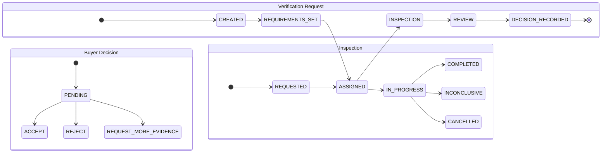
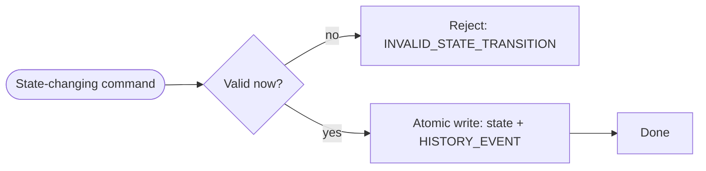

# Inspection & State Model

**Status**: Draft

**Purpose**: The explicit state machines, outcome semantics, and transition-validation rules
that govern the MVP's lifecycle — grounded in the state-separation and transition ADRs.

## Independent state machines (ADR-063/064)

Transaction, Inspection, and the Buyer decision are modeled separately
([DEC-inspection-state-separation](../decisions/DEC-inspection-state-separation.md)); a
completed inspection never implies buyer acceptance or a payment release.

## Outcome semantics (ADR-052/053/054)

Each requirement resolves to exactly one of:

- **PASS** — observation satisfied the requirement.
- **FAIL** — observed result did not satisfy the requirement (not "product defective").
- **INCONCLUSIVE** — evidence insufficient; a first-class outcome, not forced to PASS/FAIL.
- **NOT_TESTED** — distinct from FAIL (e.g. partially completed inspection).

No silent coercion among these; the report shows the per-requirement mix
([DEC-outcome-semantics](../decisions/DEC-outcome-semantics.md), ADR-025).

## Transition validation & concurrency (ADR-135..139)

Every state change validates against the entity's current state, is rejected explicitly on
an invalid transition, and is committed atomically with its history event.

- Optimistic concurrency: `UPDATE ... WHERE id=? AND version=?`; a version conflict fails
  instead of silently overwriting (ADR-138/139).
- Retries re-run the same validation; they never assume state is unchanged (ADR-140).
- Idempotency key + state validation are both applied (ADR-141).

## Immutable history (ADR-014/015/077/078/079)

A state change is committed atomically with a past-tense `HISTORY_EVENT` (ADR-103/104/137);
the original event is never overwritten. Corrections create new events preserving the
original value, actor, time and reason. A finalized inspection report is immutable.

## Buyer decision is separate (ADR-021)

After `COMPLETED`, the buyer records `ACCEPT` / `REJECT` / `REQUEST_MORE_EVIDENCE` as a
distinct state, not an automatic consequence of inspection status.
